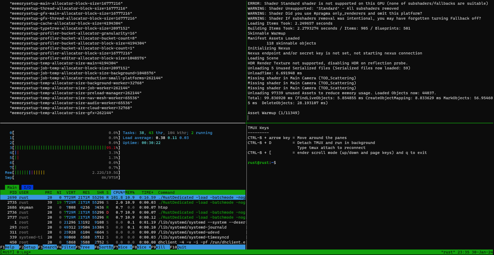

# ***Rust Game Dedicated Server Deployment Scripts***

> [!WARNING]
> Alpha State

1. Install Debian with ssh/base utils
   * Many guides for this on [youtube](https://www.youtube.com/watch?v=rf3EN7e-34g)
   * **NOTE:** you only need ssh standard utilites checked and not the full desktop environment.
3. Download the repo archive, extract, and rename folder
   * `wget -qO- https://codeload.github.com/john-clark/rustdedicated/zip/refs/heads/main | busybox unzip -`
   * `mv rustdedicated-main rustdedicated`
   > Otherwise `apt install git` and `git clone https://github.com/john-clark/rustdedicated.git`
4. Change to `cd rustdedicated/` folder
5. Run the scripts in the following order:
   * `. ./1-install-prereqs.sh`
   * `./2-install-rust.sh`
   * `./3-install-oxide.sh`
   * `./start-server.sh`

# sample screenshot

